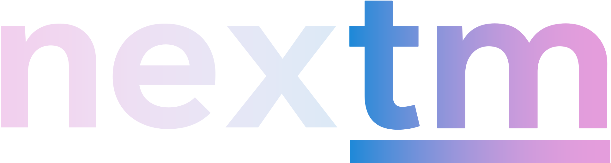
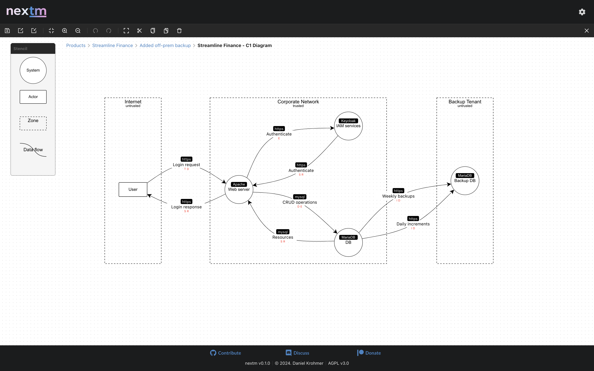
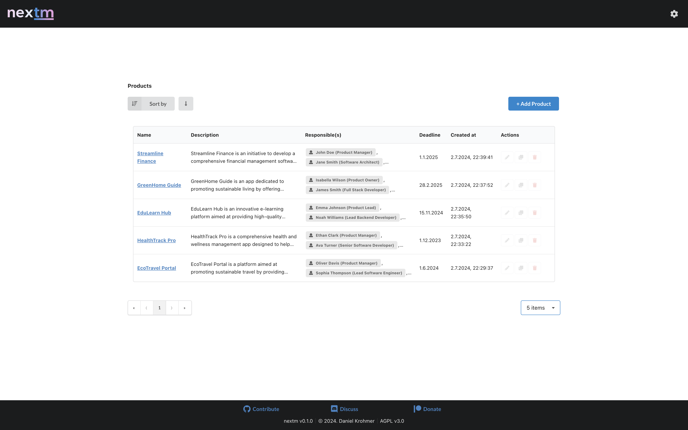
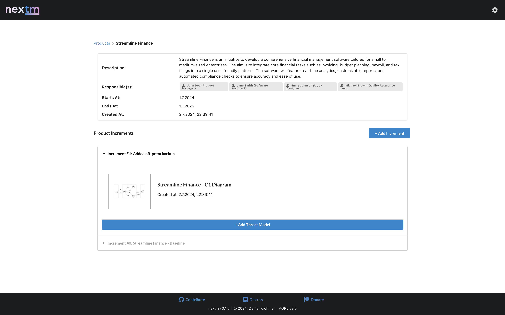

<div style="text-align: center;">
  
</div>

<br>

<p>
nexTM is a threat modeling tool tailored towards agile software development. It provides a clean and easy to use model editor which is loosely inspired by <a href="https://github.com/OWASP/threat-dragon">OWASP Threat Dragon</a> (as it also makes use of the <a href="https://github.com/antvis/X6">antvis X6</a> library). Besides the model editor, nexTM allows you to structure your threat modeling projects into products, product increments, and models to conveniently keep track of any changes  throughout application development. In the near future, it is planned to implement a "diff view" feature to highlight model changes between different increments. More coming soon...

This project uses the <a href="https://github.com/electron-react-boilerplate/electron-react-boilerplate">Electron React Boilerplate.</a>
</p>

## Screenshots
<div style="display: flex; justify-content: space-around;">
  
  
  

</div>

## Install

Clone the repo and install dependencies:

```bash
git clone https://github.com/dkrohmer/nextm.git
cd nextm-main
npm install --legacy-peer-deps
```

## Starting Development
Start the app in the `dev` environment:

```bash
npm start
```

## Starting Build

To package apps for the local platform:

```bash
npm run build
npx electron ./release/app/dist/main/main.js
```

## Packaging for Production

To package app for your local platform:

```bash
npm run package
```

## Maintainers
- [Daniel Krohmer](https://github.com/dkrohmer)

## License
AGPL v3.0 © [nexTM](https://github.com/dkrohmer/nextm)